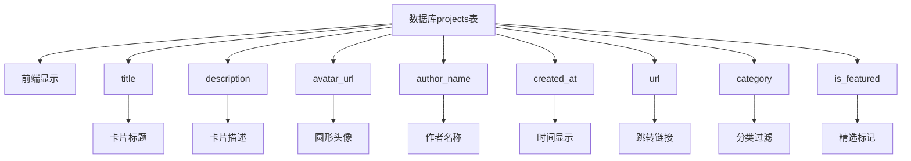

# MCP服务器数据库字段与前端显示映射文档

## 概述
本文档详细说明了`projects`表中每个字段在前端界面中的具体显示位置和用途，基于数据库架构`@data/install.sql`和实际前端代码实现。

---

## 核心显示字段

| 数据库字段 | 前端显示位置 | 实际用途 |
|---|---|---|
| `title` | **项目卡片标题** | 显示在卡片顶部，作为项目的主要名称 |
| `description` | **项目描述** | 显示在卡片中间，3行文本截断 |
| `avatar_url` | **项目图标** | 显示在卡片左上角，圆形头像 |
| `author_name` | **作者名称** | 显示在标题下方，灰色小字 |
| `created_at` | **创建时间** | 显示在卡片右下角，"X分钟前"格式 |
| `url` | **跳转链接** | 点击卡片时跳转的目标URL |
| `target` | **链接打开方式** | `"_blank"`新窗口，`"_self"`当前窗口 |

---

## 分类与标签系统

| 数据库字段 | 前端功能 | 实际用途 |
|---|---|---|
| `category` | **分类过滤** | 用于分类页面过滤，如`/category/database` |
| `tags` | **标签云** | 以文本形式显示，支持搜索过滤 |
| `is_featured` | **精选标记** | 控制是否显示在首页精选区域 |

---

## 视觉优化字段

| 数据库字段 | 前端显示 | 实际用途 |
|---|---|---|
| `avatar_url` | **项目图标** | 优先显示，无图时显示默认logo |
| `author_avatar_url` | **作者头像** | 当前未使用（保留字段） |
| `img_url` | **项目预览图** | 当前未使用（保留字段） |

---

## 排序与控制字段

| 数据库字段 | 前端行为 | 实际用途 |
|---|---|---|
| `sort` | **排序权重** | 数值越大越靠前显示 |
| `is_featured` | **精选排序** | 精选项目优先显示 |
| `created_at` | **时间排序** | 最新创建的项目优先显示 |

---

## 链接与导航

| 数据库字段 | 前端行为 | 实际用途 |
|---|---|---|
| `name` | **URL路径** | 构建`/server/{name}`详情页路径 |
| `url` | **外部链接** | 直接跳转到GitHub/MCP服务器 |
| `target` | **链接行为** | 控制在新窗口/当前窗口打开 |

---

## 状态字段说明

- `status`: 控制项目可见性
  - `"created"` - 显示
  - `"published"` - 显示  
  - `"deleted"` - 隐藏

---

## 实际前端显示示例

```typescript
// 一个典型的MCP服务器卡片显示：
┌─────────────────────────────────────────┐
│ [Avatar]  MCP Server Title              │ ← title + avatar_url
│           by Author Name                │ ← author_name
│                                         │
│ Description text here...                │ ← description
│                                         │
│ [Stars]                    2 hours ago  │ ← created_at
└─────────────────────────────────────────┘
// 点击后跳转到 url 或 /server/{name}
```

---

## 字段映射关系图

